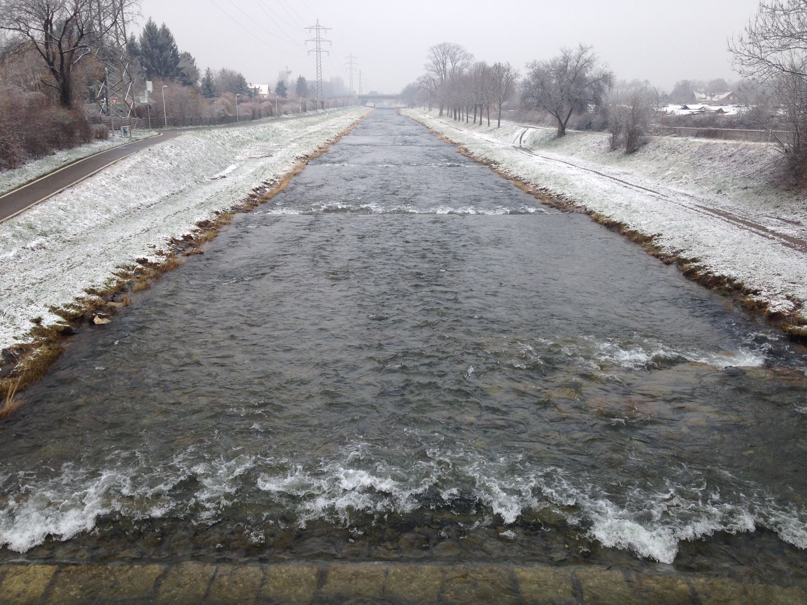
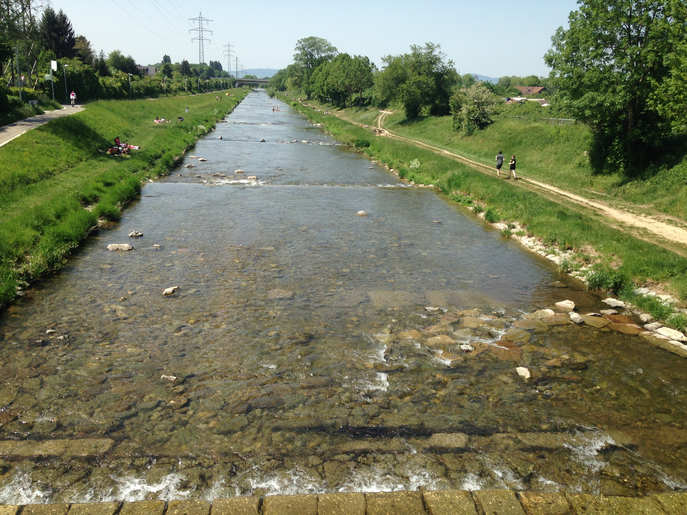

# ~ One river, one spot, many states 
Pictures of the Dreisam river in Freiburg. On-going project to document flow regime and environmental seasonality. Pictures are taken on the way between home and work.

[See the location on map](https://www.google.de/maps/place/47%C2%B059'53.2%22N+7%C2%B049'17.3%22E/@47.9981092,7.8039626,14z/data=!3m1!4b1!4m5!3m4!1s0x0:0x0!8m2!3d47.9981111!4d7.8214722)

### Nov 2017

### Jan 2018 (~60 m3/s) 

i) 5th Jan, ii) 8th Jan, iii) 12th Jan

### Feb 2018 (6.5 m3/s)

### Mar 2018 (3.8 m3/s)

### Apr 2018 (5 m3/s)

3 m^3/s

### May 2018

~ 2 m3/s

1.6 m3/s

### June 2018

### July 2018

### August 2018

